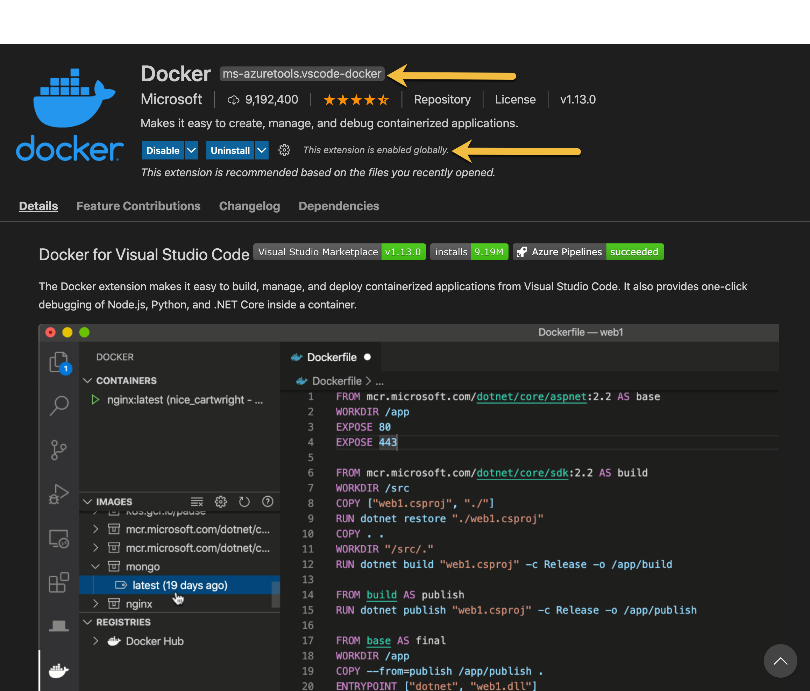
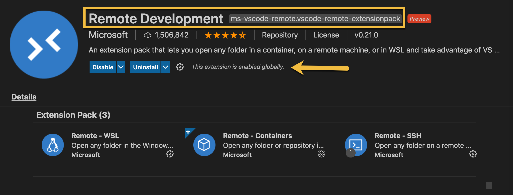

# :keyboard: ​ Visual Studio Code

The prerequisites indicated that you would need to have Visual Studio Code installed on your local machine for these exercises.  Visual Studio Code supports installing enhanced features via *Extensions* that can be installed from the Extensions Marketplace.

## Docker Extension

The first extension to add is the Docker extension.  This will provide capabilities like syntax highlighting in Dockerfiles, autocompletion of instructions, and much more.  

1. *OPEN* Visual Studio Code 
2. *CLICK* the **Extensions**  Icon on the left
3. *ENTER* `ms-azuretools.vscode-docker` in the **Search Extensions in Marketplace** box
4. *SELECT* **install**

## Remote Development Extension

This section will illustrate the additional Visual Studio Code Extension needed to integrate it with Docker. 

3. *CLICK* in the **Search Extensions in Marketplace** box 
2. *ENTER* `ms-vscode-remote.vscode-remote-extensionpack` in the **Search Extensions in Marketplace ** box
3. *SELECT* **Install**

!!! note
    Reload the window if prompted.

The Extension details will indicate that the extension is installed and enabled as seen below.

