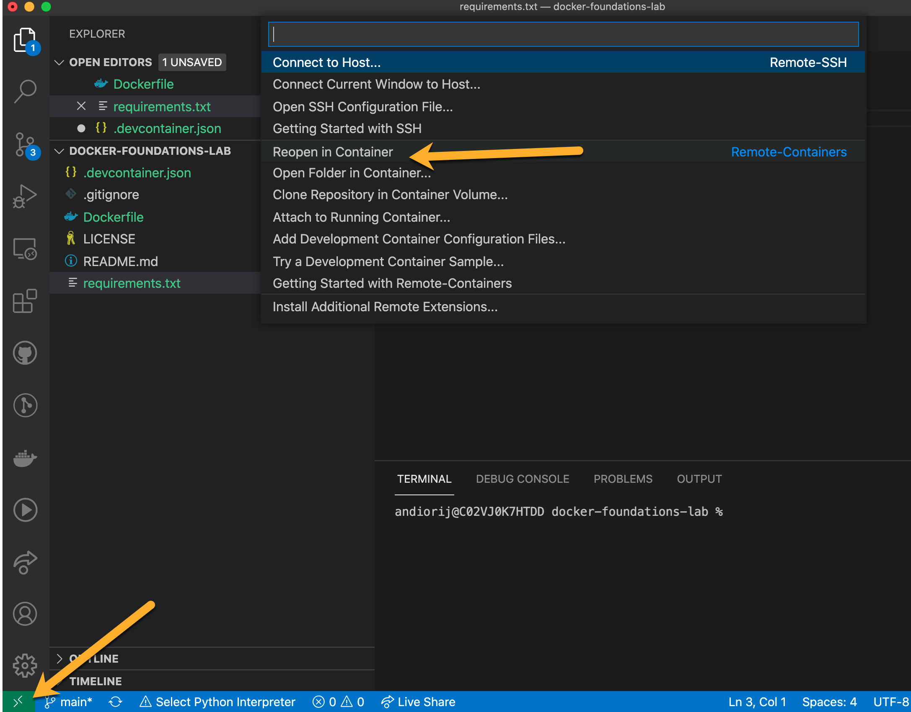
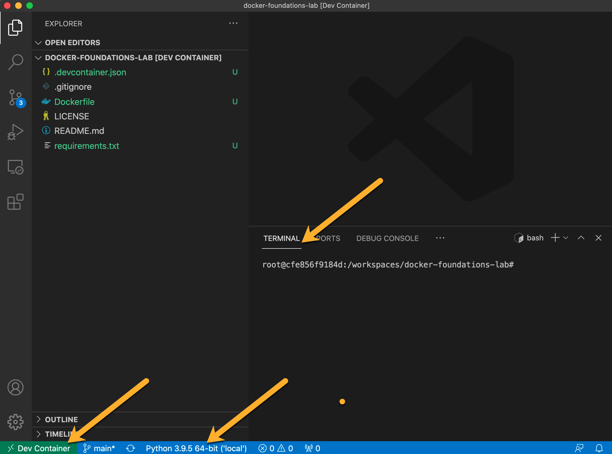

# Integrate Docker with Visual Studio Code

Visual Studio Code provides integrations with Docker that make the elements of your development environment (where you write code + where you execute code) complete seamless and highly portable.

Just including the `Dockerfile` in your repository means anyone collaborating or consuming your code will have an identical execution environment as where developed the solution.

**Scenario:** Integrate our Docker image into Visual Studio Code, so we can take advantage of the seamless development environment and utilize feature like the Python Debugger and Integrated terminal.


## Brief Overview of VSC Integration

The Visual Studio Code Remote - Container extension is one of the extensions included with the bundle we installed earlier.  This extension allows you to use a container as your fully-integrated development environment, exposing all the features of Visual Studio Code to you within it.

There are multiple ways to utilize a container as your development environment within Visual Studio Code, but we will look at the most *integrated* and *automated* method.

[Developing inside a Container](https://code.visualstudio.com/docs/remote/containers "Developing inside a Container"){target=_blank}

## Create a `.devcontainer.json` Config File

When Visual Studio Code start it looks for a configuration file named `.devcontainer.json` located either at the project root or in a subfolder named `.devcontainer`.  The existence of this file will prompt Visual Studio Code to use the contents of that configuration file to map your development environment to a container.

1. *CREATE* a **file**  named `.devcontainer.json` in the root of your project

2. *ADD* `json` formatted key/value for the Dockerfile

   ```json
   {
     "dockerFile": "Dockerfile"
   }
   ```

## Add Extensions

Earlier you added some extensions to Visual Studio Code to support the build of our Dockerfile and integration with Visual Studio Code.  Since your current project is a Python project you will want to add a Python extension to Visual Studio Code, and to the container specifically.

1. *CLICK* the **Extensions**  **Icon** on the left
2. *PASTE* `ms-python.python` in the Search box and *PRESS* **<enter\>**
3. *RIGHT-CLICK* the **extension** and select "**Add to ``devcontainer.json`**"

    

4. *OPEN* the **`devcontainer.json`** file and review the change

   [ "devcontainer.json"](../../images/devcontainer.json.png){target=_blank}

## Open Project in Container

All the pieces are now in place.  You will need to reopen your project in the container to have your fully functional Docker container-based development environment activated.

1. *CLICK* the  at the bottom left

2. *SELECT* **Reopen in Container**

   [](../../images/reopen-in-container.png){target=_blank}

3. *REVIEW*  the environment

   [](../../images/vsc-opened-in-container.png){target=_blank}

!!! attention
    Notice the bottom left corner shows **Dev Container**.  This is confirmation that you are connected to a **Remote Container** using the devcontainer integration.

!!! attention
    Notice the **terminal** (open one if it isn't open already) is inside the container (should show **root@**...).

!!! attention
    Notice that a Python Interpretter has been automatically selected for you.


## What's Next

The last thing for you to do is test the environment.  The next and last sections will provide a very basic review of the environment.
