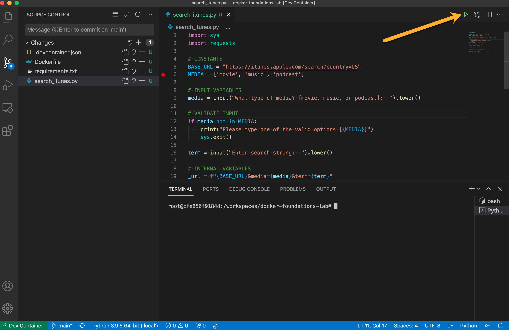

#  Visual Studio Code Development Environment Review

The goal of this walk-through was to expose you to the integrations with simple examples.  The section validates the environment is ready for use. 

## Python Integration

In this section you will create a simple Python script to retreive search results from iTunes.  You are looking to validate the Python functionality within the Visual Studio Code Editor.

:worried: Don't worry, you don't have to know any python at this point...

1. *CREATE* a **file** named `search_itunes.py`
2. *PASTE* the Python code below

    ```python
    import sys
    import requests
    
    # CONSTANTS
    BASE_URL = "https://itunes.apple.com/search?country=US"
    MEDIA = ['movie', 'music', 'podcast']
    
    # INPUT VARIABLES
    media = input("What type of media? [movie, music, or podcast]:  ").lower()
    
    # VALIDATE INPUT
    if media not in MEDIA:
        print("Please type one of the valid options [{MEDIA}]")
        sys.exit()
    
    term = input("Enter search string:  ").lower()
    
    # INTERNAL VARIABLES
    _url = f"{BASE_URL}&media={media}&term={term}"
    _session = requests.session()
    
    # MAKE REST API CALL
    results = _session.get(_url)
    
    # EXTRACT RESULT DATA FROM RESONSE OBJECT
    data = results.json()['results']
    
    # LOOP OVER RESULTS AND PRINT
    for result in data:
        print(f"{result['trackName']:<50}{result['releaseDate']:>50}")
    
    
    ```

3. *SAVE* the **file**

4. *CLICK* the green play button

   

5. *ANSWER* the prompts

6. *REVIEW* the results

The presence of the **green** play button indicates the Python extension is working.  

You can also see the Python Debugger on the left, the 4th icon down. 

